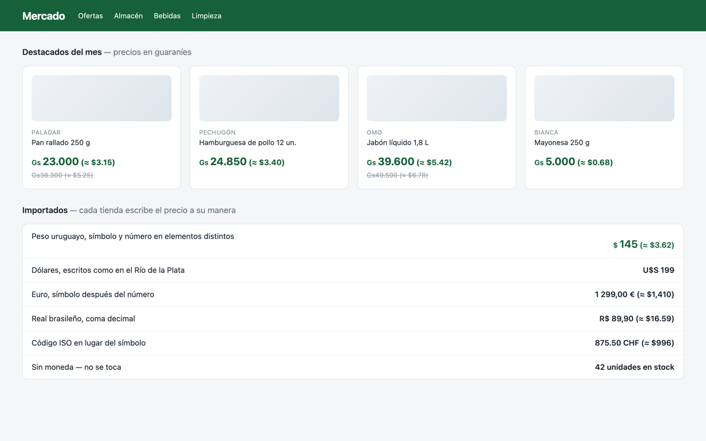

# How Much? — Currency Price Converter

Prices, in the currency you think in. On a web page, and through a phone camera.

## The extension

A Chrome extension (Manifest V3) that scans the prices on any web page and shows
them in the currency you care about, inline, next to the original:

> The jacket costs **$129.00 (≈ 119 EUR)**.

No build step, no framework, no API key.

Prices the page renders as separate elements (`<span>Gs</span><span>23.000</span>`,
which is how most store templates emit them) are handled too, as are the shapes
shops reach for instead of a plain symbol: a superscript minor unit
(`189⁹⁹ RSD`), a dash where the cents go (`1.449,–`), and Sweden's `429:-`,
which names no currency at all.



The popup picks the target currency, and can settle what a bare `$` means —
though by default it works that out from the page itself, since much of Latin
America prints `$` and means a peso:


Both shots are of [extension/test/demo.html](extension/test/demo.html) and are
regenerated by [`tools/screenshots.sh`](tools/screenshots.sh), which runs the
real `currency.js` and `content.js` against the page rather than staging the
result by hand.

## Layout

| Directory | What it holds |
| --- | --- |
| [`extension/`](extension) | The Chrome extension — everything that ships in the zip, plus its test pages. |
| [`android/`](android) | The Android app: `:core` holds the price rules, `:app` the camera and the recognizer. See [`android/README.md`](android/README.md). |
| [`ios/`](ios) | The iOS app. Not written yet; [`ios/README.md`](ios/README.md) records the decisions it starts from. |
| [`tools/`](tools) | Build, screenshot and icon scripts, and the [OCR benchmark](tools/ocr-bench) the phone versions are being designed against. |

The phone apps read prices off a photo or the camera instead of the DOM, but the
hard-won part — the currency tables, the number grammar, what counts as a price
next to a number — is the same problem the extension already solved, so they are
kept in one repository rather than three.

## The Android app

Point it at a price and the converted amount is drawn over the price itself, the
way a live translation is. It reads a photograph too, taken or chosen from the
gallery.

Two currencies, and they are not the same question: what the prices are in is
detected from the country the phone is standing in, and what to convert into
from the country it is *from*. That distinction is the whole point — abroad,
converting the local currency into itself would be no help at all.

Everything that reads runs on the phone: PP-OCRv5's mobile models through ONNX
Runtime, with no account and no key. The only thing that leaves it is a request
for the rate table, cached for six hours — never a picture, and nothing about
where you are.

Which recognizer, and why, was settled by measurement rather than by reading
datasheets — [`tools/ocr-bench`](tools/ocr-bench) scores engines on whether the
extension's own price rules would have produced the right conversion, counting a
wrong price separately from a missed one. [`android/README.md`](android/README.md)
has the numbers, the build, and the things that turned out not to work.

## Install the Android app

Not in Google Play — it installs from the APK on the
[Releases page](https://github.com/belyakovvitaly/how-much-converter/releases),
under a tag beginning `android-`.

1. Download `how-much-android-<version>.apk` onto the phone.
2. Open it. Android will ask whether to allow installing apps from wherever you
   downloaded it; that permission is per-app and can be turned off again after.
3. Allow the camera when it asks. The rates need the network once every six
   hours; nothing else leaves the phone.

Worth knowing:

- **64-bit ARM only**, which is every phone made in the last decade but not the
  oldest 32-bit ones. Android 8.0 or newer.
- It is a debug build, signed with the standard debug key. That is what lets it
  be sideloaded at all without a keystore, and it is also why Play Protect may
  warn about it.
- About 62 MB, most of which is the recognizer's native library and 13 MB of
  models. It reads without the network and there is nothing to download on first
  run.

Building it yourself needs an Android SDK and one extra step — the OCR models
are generated, not committed — both described in
[`android/README.md`](android/README.md).

## Install the extension

Not in the Chrome Web Store yet — see [STORE.md](STORE.md) for what a submission
needs. Until then it installs from a zip:

1. Download `how-much-<version>.zip` from the
   [Releases page](https://github.com/belyakovvitaly/how-much-converter/releases).
   No release yet? Use **Code → Download ZIP** on the repository instead.
2. Unzip it. Double-click on macOS, or right-click → **Extract All** on Windows.
3. Find the folder with `manifest.json` in it. In the release zip that is the
   top folder; in a **Download ZIP** of the whole repository it is the
   `extension` folder inside, since the repository also holds the phone apps.
4. Open `chrome://extensions` and turn on **Developer mode** (top right).
5. Click **Load unpacked** and select that folder.
6. Pin the extension, then open its popup and pick your target currency.

Worth knowing:

- **Keep the folder.** Chrome loads the extension from it at every start, so
  moving or deleting it breaks the extension. Put it somewhere permanent, not in
  Downloads.
- Chrome may warn about developer-mode extensions on startup. That is the price
  of installing outside the store; dismissing it is fine.
- There are no automatic updates — to move to a new version, download it and
  repeat.
- A `.crx` file will not work: Chrome only installs those from the Web Store.
  Unpacked is the only off-store route.

## Package

```sh
./tools/build.sh
```

Writes `dist/how-much-<version>.zip`, laid out the way the store wants it.
Pushing a `v<version>` tag builds the same zip in CI and attaches it to a
GitHub release.

## How it works

| Part | File | Responsibility |
| --- | --- | --- |
| Rates | `extension/src/background.js` | Fetches a USD-based rate table from [open.er-api.com](https://open.er-api.com) and caches it in `chrome.storage.local` for 6 hours. All pairs are derived as cross rates. |
| Detection | `extension/src/currency.js` | Symbol/ISO-code tables and a locale-aware number parser (`1 234,56` vs `1,234.56` vs `1'234.56`). |
| Which currency a page is in | `extension/src/currency.js` | `priceCurrency` markup first, then the ccTLD, then the `lang` attribute — and where the first two disagree, the language breaks the tie. This is what makes a shared symbol readable. |
| Page changes | `extension/src/content.js` | Two passes — text nodes that hold a whole price, then shallow elements that spread one across children — appending the converted value in a `.hmc-conv` span, and re-scanning on DOM mutations. |
| Settings | `extension/src/popup.*` | Target currency, what `$` should mean, on/off, a manual rate refresh, and the list of reported pages. |

## Reporting a page that does not work

Detection is heuristics against markup nobody standardized, so some shops will
slip through. The popup has **It didn't work here**, which saves a note about
that page: its address, the currency the extension decided the page was priced
in, how many prices it converted, your settings, the version, and a few of the
price-shaped strings it left alone. Those samples are the part worth having —
"a shop in Bolivia failed" is a puzzle, `"Bs21,50"` is an afternoon's fix.

**Copy** puts the list on the clipboard and **Report on GitHub** opens the issue
form with it filled in, which is as far as either goes on its own: the text sits
in a form on your screen until you submit it yourself.

The list lives in `chrome.storage.local` and goes nowhere on its own — no
server, no account, nothing sent in the background. It exists in this browser
profile only, which also means it does not follow you to another machine.

## Known limitations

- Only currencies placed **directly** before or after the number are recognized
  (`$5`, `5 USD`, `340 руб`), not prose like "five dollars".
- A symbol several countries share — `$`, `¥`, `kr`, `Bs`, `R`, `元` — is read
  only where the page says which country it is, through its `priceCurrency`
  markup, its address or its language. Where none of those answer, the price is
  left alone rather than guessed at. **Treat "$" as** overrides this for `$`.
- A split price is found only when the element around it is small — up to three
  children, six descendants, and 40 characters of text once whitespace is
  collapsed. That covers the usual store-template shapes, not every one.
- An element holding two split prices at once is skipped, because there is no
  way to say which one an appended conversion belongs to.

## Roadmap ideas

- Per-site currency overrides.
- Hover tooltip with the rate and fetch time instead of inline text.
- Offline fallback bundle of rates.
- The iOS app in [`ios/`](ios). The price rules, the rates and the voting are
  already shared code in `android/core`; what iOS needs of its own is the
  recognizer, and the benchmark says Vision does that job without help.
- Reading a tag seen at a steep angle. Rotation is handled; foreshortening is
  not, and needs the region's quadrilateral rather than one angle.

## Privacy

Nothing is collected and nothing about the pages you visit leaves the browser —
see [PRIVACY.md](PRIVACY.md).

## License

MIT — see [LICENSE](LICENSE).
