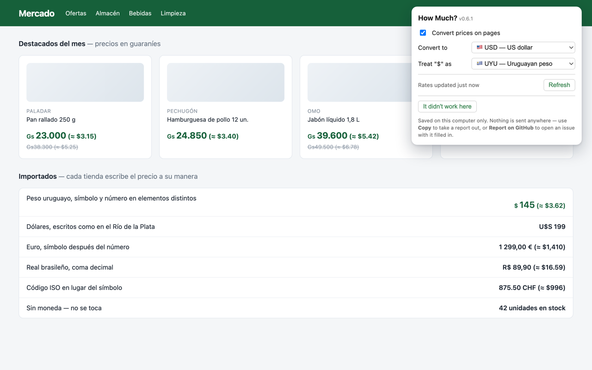

# How Much? — Currency Price Converter

A Chrome extension (Manifest V3) that scans the prices on any web page and shows
them in the currency you care about, inline, next to the original:

> The jacket costs **$129.00 (≈ 119 EUR)**.

No build step, no framework, no API key.

Prices the page renders as separate elements (`<span>Gs</span><span>23.000</span>`,
which is how most store templates emit them) are handled too. The popup picks the
target currency and settles what a bare `$` means — much of Latin America prints
`$` and means a peso:



The shot is of [extension/test/demo.html](extension/test/demo.html) and is
regenerated by [`tools/screenshots.sh`](tools/screenshots.sh), which also writes
`docs/screenshot-inline.png` — the same page without the popup, for the store
listing.

## Layout

| Directory | What it holds |
| --- | --- |
| [`extension/`](extension) | The Chrome extension — everything that ships in the zip, plus its test pages. |
| [`android/`](android) | The Android app. Not written yet; [`android/README.md`](android/README.md) records the engine decision it starts from. |
| [`ios/`](ios) | The iOS app, likewise — see [`ios/README.md`](ios/README.md). |
| [`tools/`](tools) | Build, screenshot and icon scripts, and the [OCR benchmark](tools/ocr-bench) the phone versions are being designed against. |

The phone apps read prices off a photo or the camera instead of the DOM, but the
hard-won part — the currency tables, the number grammar, what counts as a price
next to a number — is the same problem the extension already solved, so they are
kept in one repository rather than three.

## Install

Not in the Chrome Web Store yet — see [STORE.md](STORE.md) for what a submission
needs. Until then it installs from a zip:

1. Download `how-much-<version>.zip` from the
   [Releases page](https://github.com/belyakovvitaly/how-much-converter/releases).
   No release yet? Use **Code → Download ZIP** on the repository instead.
2. Unzip it. Double-click on macOS, or right-click → **Extract All** on Windows.
3. Find the folder with `manifest.json` in it. In the release zip that is the
   top folder; in a **Download ZIP** of the whole repository it is the
   `extension` folder inside, since the repository also holds the phone apps.
4. Open `chrome://extensions` and turn on **Developer mode** (top right).
5. Click **Load unpacked** and select that folder.
6. Pin the extension, then open its popup and pick your target currency.

Worth knowing:

- **Keep the folder.** Chrome loads the extension from it at every start, so
  moving or deleting it breaks the extension. Put it somewhere permanent, not in
  Downloads.
- Chrome may warn about developer-mode extensions on startup. That is the price
  of installing outside the store; dismissing it is fine.
- There are no automatic updates — to move to a new version, download it and
  repeat.
- A `.crx` file will not work: Chrome only installs those from the Web Store.
  Unpacked is the only off-store route.

## Package

```sh
./tools/build.sh
```

Writes `dist/how-much-<version>.zip`, laid out the way the store wants it.
Pushing a `v<version>` tag builds the same zip in CI and attaches it to a
GitHub release.

## How it works

| Part | File | Responsibility |
| --- | --- | --- |
| Rates | `extension/src/background.js` | Fetches a USD-based rate table from [open.er-api.com](https://open.er-api.com) and caches it in `chrome.storage.local` for 6 hours. All pairs are derived as cross rates. |
| Detection | `extension/src/currency.js` | Symbol/ISO-code tables and a locale-aware number parser (`1 234,56` vs `1,234.56`). |
| Page changes | `extension/src/content.js` | Two passes — text nodes that hold a whole price, then shallow elements that spread one across children — appending the converted value in a `.hmc-conv` span, and re-scanning on DOM mutations. |
| Settings | `extension/src/popup.*` | Target currency, what `$` should mean, on/off, a manual rate refresh, and the list of reported pages. |

## Reporting a page that does not work

Detection is heuristics against markup nobody standardized, so some shops will
slip through. The popup has **Report this page**, which saves that page's URL to
a list you can read, copy, and clear from the popup itself.

The list lives in `chrome.storage.local` and goes nowhere — no server, no
account, nothing sent anywhere. It exists in this browser profile only, which
also means it does not follow you to another machine.

## Known limitations

- Only currencies placed **directly** before or after the number are recognized
  (`$5`, `5 USD`, `340 руб`), not prose like "five dollars".
- A bare `$` is assumed to be USD unless you change **Treat "$" as** in the popup.
- A split price is found only when the element around it is small — up to three
  children, six descendants, and 40 characters of text once whitespace is
  collapsed. That covers the usual store-template shapes, not every one.
- An element holding two split prices at once is skipped, because there is no
  way to say which one an appended conversion belongs to.

## Roadmap ideas

- Per-site currency overrides.
- Hover tooltip with the rate and fetch time instead of inline text.
- Offline fallback bundle of rates.
- The phone versions in [`android/`](android) and [`ios/`](ios).
  [`tools/ocr-bench`](tools/ocr-bench) has already settled which OCR engines
  they can be built on, scoring them through the detection rules in
  `extension/src/currency.js` rather than on raw text accuracy.

## Privacy

Nothing is collected and nothing about the pages you visit leaves the browser —
see [PRIVACY.md](PRIVACY.md).

## License

MIT — see [LICENSE](LICENSE).
